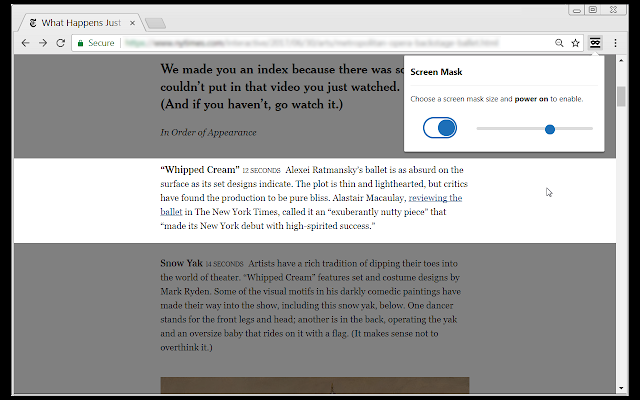
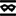

# Screen Mask

A website and web document reading aid.

Screen Mask is website or web document reading tool that follows your mouse or touch to help eliminate page distractions so that you can focus on reading one passage at a time.



## Demo

You can install from the [Chrome Web Store](https://chrome.google.com/webstore/detail/screen-mask/mhccomhlpeimdkagphppaoefhkeopnho) or from [Microsoft Edge Add-ons](https://microsoftedge.microsoft.com/addons/detail/screen-mask/dfanfcmhbdocjfpmnoebccndgmhlincl)

## License

MIT details can be found [here](license.md)

## Get Started

Clone the repo and install the dependencies.

```
npm i
```

This is an angular-cli (angular 9) project, so you may want to install this globally.

```
npm i @angular/cli@9.x.x -g
```

Test the extension

```
npm run test
```

Build the extension

```
npm run build
```

Verify build

1. Open chrome extension (**chrome://extensions/**)
2. Toggle **Developer mode**
3. **Load unpacked** extension
4. Select the **dist** directory for your build
5. Click the Screen Mask icon  on your Chrome extension bar 


Note: This extension will not work on the extensions page or the Chrome Web Store as a security precaution.
